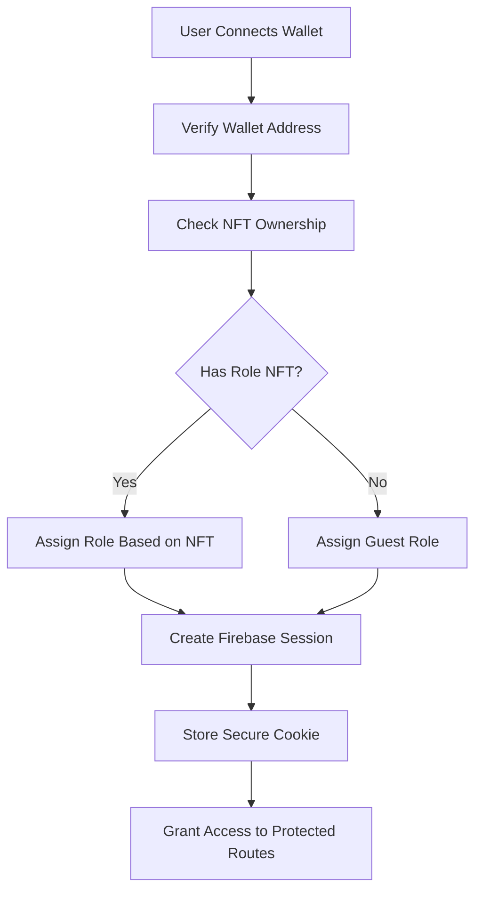

# Secure NFT-Based Authentication System

## Overview

This document describes the secure authentication system implemented for DecentraMind's healthcare platform. The system replaces mock localStorage authentication with Firebase/Supabase integration and connects user roles directly to NFT ownership on the Solana blockchain.

## Architecture

### 1. Authentication Flow



### 2. NFT-to-Role Mapping

| NFT Contract | Role | Access Level | Description |
|--------------|------|--------------|-------------|
| Care Orchestrator NFT | `provider` | Healthcare Provider | Access to provider workspace, patient management |
| DMTX DAO Token | `admin` | Administrator | Full system access, hospital management |
| Patient NFT | `patient` | Patient | Access to patient portal, health records |
| None | `guest` | Guest | Limited access to public pages |

## Implementation Components

### 1. NFT Ownership Service (`app/services/nftOwnershipService.ts`)

Core service for verifying NFT ownership on Solana:

```typescript
// Check if wallet owns specific NFTs
const ownedNFTs = await nftOwnershipService.checkNFTOwnership(walletAddress, contractAddresses);

// Determine user role from NFT ownership
const role = await nftOwnershipService.getUserRoleFromNFTs(walletAddress);

// Verify specific NFT ownership
const hasNFT = await nftOwnershipService.verifyNFTOwnership(walletAddress, contractAddress);
```

**Key Features:**
- Solana blockchain integration
- NFT metadata fetching
- Role hierarchy validation
- Comprehensive error handling

### 2. Secure Authentication Service (`app/services/secureAuthService.ts`)

Firebase-based authentication with NFT verification:

```typescript
// Sign in with wallet and verify NFTs
const session = await secureAuthService.signInWithWallet(walletAddress);

// Check current user
const user = secureAuthService.getCurrentUser();

// Verify role access
const hasAccess = secureAuthService.hasRole('provider');
```

**Key Features:**
- Firebase Authentication integration
- Custom token creation
- Secure session management
- Real-time role updates

### 3. Updated Role Check Hook (`app/hooks/useRoleCheck.ts`)

Enhanced hook with secure authentication:

```typescript
const { user, isLoading, isAuthorized, signInWithWallet, signOut } = useProviderAccess();

// Sign in with wallet
await signInWithWallet(walletAddress);

// Sign out
await signOut();

// Refresh role based on current NFT ownership
await refreshRole();
```

**Key Features:**
- Real-time authentication state
- Automatic role verification
- Secure cookie management
- Error handling and loading states

### 4. Enhanced Middleware (`middleware.ts`)

Server-side route protection with session validation:

```typescript
// Validates session integrity
function isValidSession(request: NextRequest): boolean {
  const cookieSession = request.cookies.get('auth-session')?.value;
  // Validates session age, required fields, and format
}

// Gets user role from secure cookie
function getUserRole(request: NextRequest): UserRole {
  // Extracts role from validated session cookie
}
```

**Key Features:**
- Session validation
- Role-based route protection
- Automatic redirects
- Security headers

### 5. Secure Login Page (`app/login/page.tsx`)

Wallet-based authentication interface:

```typescript
// Connect wallet and verify NFTs
const connectWallet = async () => {
  const walletAddress = await walletAdapter.connect();
  const role = await nftOwnershipService.getUserRoleFromNFTs(walletAddress);
  // Display role and available access
};
```

**Key Features:**
- Wallet connection interface
- NFT verification display
- Role-based access information
- Security notices

## Security Features

### 1. Blockchain Verification
- **NFT Ownership**: Verified on-chain through Solana RPC
- **Wallet Validation**: Proper Solana address format checking
- **Real-time Updates**: Role changes when NFT ownership changes

### 2. Session Security
- **Secure Cookies**: HttpOnly, Secure, SameSite attributes
- **Session Expiration**: 24-hour timeout with automatic refresh
- **Token Validation**: Firebase custom tokens with role claims

### 3. Route Protection
- **Server-side Validation**: Middleware checks before page load
- **Client-side Guards**: React hooks prevent unauthorized access
- **Automatic Redirects**: Seamless user experience

### 4. Data Privacy
- **No Private Keys**: Wallet private keys never leave user device
- **Minimal Data Storage**: Only essential user data stored
- **Encrypted Sessions**: All session data encrypted

## Usage Examples

### 1. Protecting a Page Component

```typescript
'use client';

import { useProviderAccess } from '../hooks/useRoleCheck';

const ProtectedPage: React.FC = () => {
  const { user, isLoading, isAuthorized, signInWithWallet } = useProviderAccess();

  if (isLoading) {
    return <div>Verifying access...</div>;
  }

  if (!isAuthorized) {
    return (
      <div>
        <h1>Access Required</h1>
        <button onClick={() => signInWithWallet(walletAddress)}>
          Connect Wallet
        </button>
      </div>
    );
  }

  return (
    <div>
      <h1>Welcome, {user?.profile.name}</h1>
      <p>Role: {user?.role}</p>
      {/* Protected content */}
    </div>
  );
};
```

### 2. Checking NFT Ownership

```typescript
import { nftOwnershipService } from '../services/nftOwnershipService';

// Check if user has admin access
const hasAdminAccess = await nftOwnershipService.hasRoleAccess(
  walletAddress, 
  'admin'
);

// Get all role NFTs owned by user
const roleNFTs = await nftOwnershipService.getAllRoleNFTs(walletAddress);
```

### 3. Refreshing User Role

```typescript
import { secureAuthService } from '../services/secureAuthService';

// Refresh role when NFT ownership might have changed
await secureAuthService.refreshUserRole();

// Listen for authentication state changes
const unsubscribe = secureAuthService.onAuthStateChange((user) => {
  console.log('User role updated:', user?.role);
});
```

## Configuration

### 1. Environment Variables

```bash
# Firebase Configuration
NEXT_PUBLIC_FIREBASE_API_KEY=your-api-key
NEXT_PUBLIC_FIREBASE_AUTH_DOMAIN=your-domain
NEXT_PUBLIC_FIREBASE_PROJECT_ID=your-project-id

# Solana Configuration
NEXT_PUBLIC_SOLANA_RPC_URL=https://api.devnet.solana.com
NEXT_PUBLIC_SOLANA_NETWORK=devnet

# NFT Contract Addresses
NEXT_PUBLIC_CARE_ORCHESTRATOR_NFT_CONTRACT=contract-address
NEXT_PUBLIC_DMTX_DAO_TOKEN_CONTRACT=contract-address
NEXT_PUBLIC_PATIENT_NFT_CONTRACT=contract-address
```

### 2. Firebase Setup

1. Create Firebase project
2. Enable Authentication
3. Configure Firestore database
4. Set up custom token creation endpoint
5. Configure security rules

### 3. Solana Integration

1. Deploy NFT contracts
2. Configure RPC endpoints
3. Set up wallet adapters
4. Test NFT ownership verification

## Testing Scenarios

### 1. NFT Ownership Verification
- Connect wallet with Care Orchestrator NFT
- Verify provider role assignment
- Test access to provider workspace

### 2. Role Hierarchy
- Admin with DMTX DAO Token can access all routes
- Provider with Care Orchestrator NFT can access provider routes
- Patient with Patient NFT can access patient routes

### 3. Session Management
- Session persists across browser refreshes
- Session expires after 24 hours
- Role updates when NFT ownership changes

### 4. Security Validation
- Invalid sessions redirect to login
- Unauthorized access shows appropriate error
- Wallet disconnection clears session

## Production Considerations

### 1. Performance Optimizations
- Cache NFT ownership results
- Implement rate limiting
- Use CDN for static assets
- Optimize RPC calls

### 2. Security Enhancements
- Implement CSRF protection
- Add audit logging
- Set up monitoring alerts
- Regular security audits

### 3. Scalability
- Database indexing
- Load balancing
- Caching strategies
- API rate limiting

### 4. Monitoring
- Authentication success/failure rates
- NFT verification performance
- Session management metrics
- Error tracking and alerting

## Migration from Mock System

### 1. Removed Components
- ❌ `localStorage` role storage
- ❌ Mock user data
- ❌ Development mode role buttons
- ❌ Hardcoded role assignments

### 2. Added Components
- ✅ Firebase Authentication
- ✅ Solana NFT verification
- ✅ Secure session management
- ✅ Real-time role updates

### 3. Updated Components
- ✅ Role check hooks
- ✅ Middleware validation
- ✅ Login page interface
- ✅ Unauthorized page

## Error Handling

The system provides comprehensive error handling:

- **Wallet Connection Errors**: Clear messaging and retry options
- **NFT Verification Failures**: Graceful fallbacks and error states
- **Session Expiration**: Automatic redirect to login
- **Network Issues**: Retry mechanisms and offline handling

## Browser Compatibility

- Modern browsers with Web3 support
- Solana wallet extensions
- Firebase Authentication support
- Secure cookie handling

## Future Enhancements

- Multi-chain NFT support
- Advanced role hierarchies
- Granular permission system
- Real-time NFT monitoring
- Mobile wallet integration
- Biometric authentication
- Multi-factor authentication
