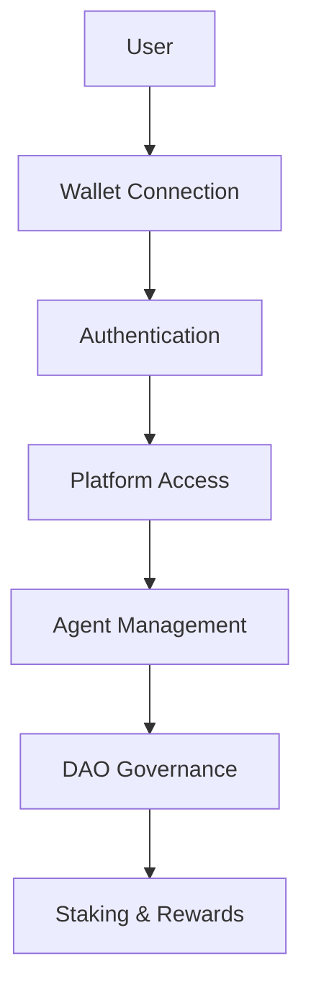

# Architecture Diagrams

This directory contains architectural diagrams and visual documentation for the DecentraMind platform.

## 📋 **Diagram Types**

### **System Architecture**
- **High-level Architecture**: Overall system design and component relationships
- **Component Diagrams**: Detailed component interactions
- **Data Flow Diagrams**: Information flow between systems
- **Deployment Diagrams**: Infrastructure and deployment architecture

### **User Flows**
- **Authentication Flow**: Wallet connection and user authentication
- **Agent Creation Flow**: Agent minting and evolution process
- **DAO Governance Flow**: Proposal creation and voting process
- **Staking Flow**: Token staking and reward claiming

### **Blockchain Integration**
- **Smart Contract Architecture**: Contract relationships and interactions
- **Transaction Flow**: On-chain transaction processes
- **Token Economics**: DMT/DMTX token flow and distribution
- **Governance Structure**: DAO governance and voting mechanisms

## 🎨 **Diagram Standards**

### **Format Requirements**
- **Primary Format**: Mermaid (`.md` files with mermaid code blocks)
- **Backup Format**: PNG/SVG for complex diagrams
- **Version Control**: All diagrams tracked in Git
- **Naming Convention**: `[type]-[name].md` (e.g., `architecture-system-overview.md`)

### **Style Guidelines**
- **Colors**: Consistent color scheme across all diagrams
- **Typography**: Clear, readable fonts
- **Icons**: Standard icons for different component types
- **Layout**: Logical flow from left to right, top to bottom

## 📁 **Directory Structure**

```
diagrams/
├── README.md                           # This file
├── architecture/                       # System architecture diagrams
│   ├── system-overview.md             # High-level system architecture
│   ├── component-interactions.md      # Component relationship diagram
│   └── data-flow.md                   # Data flow diagram
├── user-flows/                        # User journey diagrams
│   ├── authentication-flow.md         # Wallet authentication process
│   ├── agent-creation-flow.md         # Agent minting process
│   ├── dao-governance-flow.md         # Proposal and voting process
│   └── staking-flow.md                # Staking and rewards process
├── blockchain/                        # Blockchain-specific diagrams
│   ├── smart-contract-architecture.md # Contract relationships
│   ├── transaction-flow.md            # On-chain transaction process
│   ├── token-economics.md             # Token flow and distribution
│   └── governance-structure.md        # DAO governance structure
└── deployment/                        # Infrastructure diagrams
    ├── infrastructure-overview.md     # Deployment architecture
    ├── network-topology.md            # Network configuration
    └── security-architecture.md       # Security measures
```

## 🔧 **Creating Diagrams**

### **Mermaid Syntax**


### **Best Practices**
- **Keep it Simple**: Focus on key relationships and flows
- **Use Consistent Naming**: Standardize component and process names
- **Include Legends**: Explain symbols and colors used
- **Update Regularly**: Keep diagrams in sync with implementation
- **Version Control**: Track changes in Git

## 🔗 **Integration**

### **Documentation Links**
- **Architecture.md**: Links to system architecture diagrams
- **Module Documentation**: Links to relevant user flow diagrams
- **API.md**: Links to blockchain integration diagrams
- **Deployment.md**: Links to infrastructure diagrams

### **Maintenance**
- **Regular Reviews**: Monthly diagram review and updates
- **Change Tracking**: Update diagrams when architecture changes
- **Quality Checks**: Ensure diagrams are accurate and current
- **Feedback Integration**: Incorporate team feedback

## 📊 **Diagram Status**

### **Completed Diagrams**
- [ ] System Architecture Overview
- [ ] Authentication Flow
- [ ] Agent Creation Flow
- [ ] DAO Governance Flow
- [ ] Staking Flow
- [ ] Smart Contract Architecture
- [ ] Token Economics Flow
- [ ] Deployment Infrastructure

### **Planned Diagrams**
- [ ] Component Interaction Details
- [ ] Data Flow Analysis
- [ ] Security Architecture
- [ ] Performance Monitoring
- [ ] Error Handling Flow
- [ ] Testing Architecture

---

**🎯 GOAL**: Provide clear, accurate, and maintainable visual documentation that helps developers, users, and stakeholders understand the DecentraMind platform architecture and processes. 